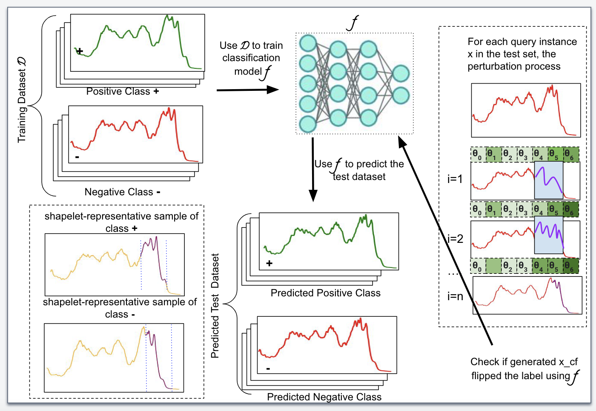

# SG-CF: Shapelet-Guided Counterfactual Explanation for Time Series Data
This is the repository for our paper titled "[SG-CF: Shapelet-Guided Counterfactual Explanation for Time Series Data](https://ieeexplore.ieee.org/abstract/document/10020866/)". This paper has been accepted at [2022 IEEE International Conference on Big Data (Big Data)](https://bigdataieee.org/BigData2022/)

# Abstract
EXplainable Artificial Intelligence (XAI) methods have gained much momentum lately given their ability to shed light on the decision function of opaque machine learning models. There are two dominating XAI paradigms: feature attribution and counterfactual explanation methods. While the first family of methods explains $why$ the model made a decision, counterfactual methods aim at answering \textit{what-if} the input is slightly different and results in another classification decision. Most research efforts have focused on answering the $why$ question for time series data modality. In this paper, we aim to answer the \textit{what-if} question by finding a good balance between a set of desirable counterfactual explanation properties. We propose Shapelet-guided Counterfactual Explanation  (SG-CF). This novel optimization-based model generates interpretable, intuitive post-hoc counterfactual explanations of time series classification models that balance validity, sparsity, proximity, interpretability, and contiguity. Our experimental results on nine real-world time-series datasets show that our proposed method can generate counterfactual explanations that balance all the desirable counterfactual properties compared to other competing baselines.

# Approach

# Prerequisites and Instructions
All python packages needed are listed in [pip-requirements.txt](pip-requirements.txt) file and can be installed simply using the pip command.
Run the SG_CF.ipynb file to get the evaluation results presented in the paper.

# Data
The data used in this project comes from the [UCR](https://www.cs.ucr.edu/~eamonn/time_series_data_2018/) archive.

# Reference
If you re-use this work, please cite:

@inproceedings{li2022sg,
  title={SG-CF: Shapelet-Guided Counterfactual Explanation for Time Series Classification},
  author={Li, Peiyu and Bahri, Omar and Boubrahimi, Souka{\"\i}na Filali and Hamdi, Shah Muhammad},
  booktitle={2022 IEEE International Conference on Big Data (Big Data)},
  pages={1564--1569},
  year={2022},
  organization={IEEE}
}
